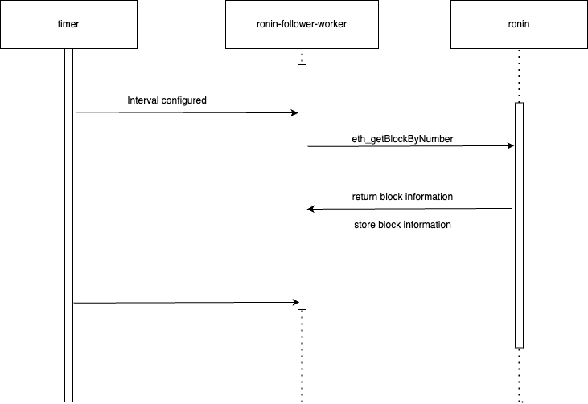
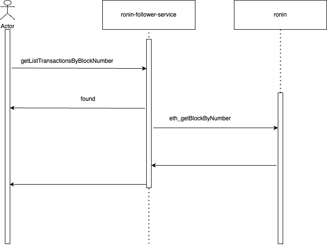
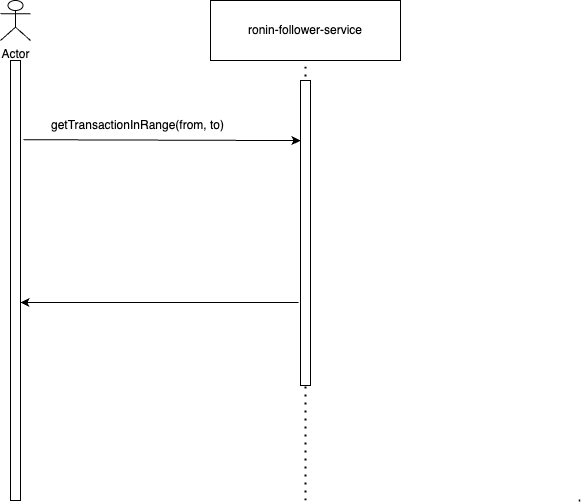
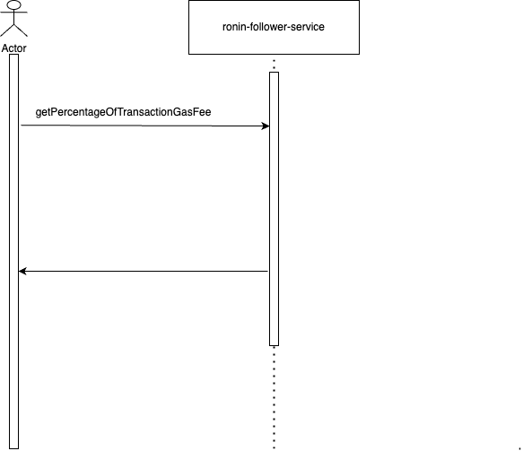

## How to start

Start the service server to serve HTTP requests and a worker to synchronize blocks from Ronin.

```bash
./scripts/bin.sh service start
```

How worker works

```text
The worker will run at a configured interval, so at each interval the worker will call Ronin to get the next block.
For first block, the worker calls Ronin to get the most recent block and store it
For next block, the workers calls Ronin to get next block using the number of the last synced block.
```

Eviction strategy

```text
To avoid a memory leak, I have a configuration for maximum capacity. After reaching maximum capacity, the heading block is poped.
```

Data structure

```text
I used a doubly linked list to store blocks. It is convenient for implementing an eviction strategy.
```

## Worker synchronizes with Ronin



## API Transaction by hash


## API List transactions by block number



## API list transaction in range



## API get percentage of transactions which have gas fee lees than




